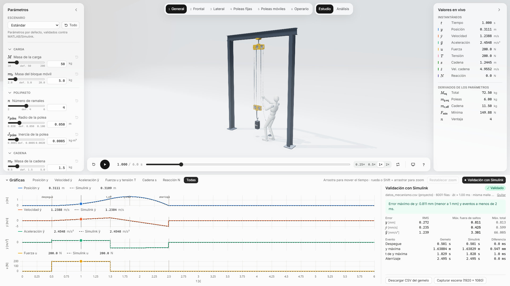
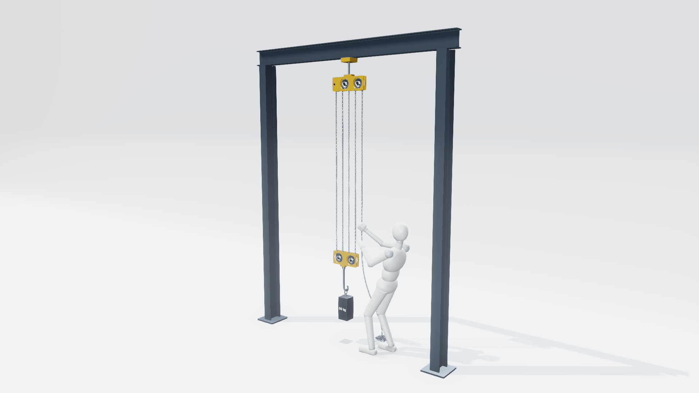
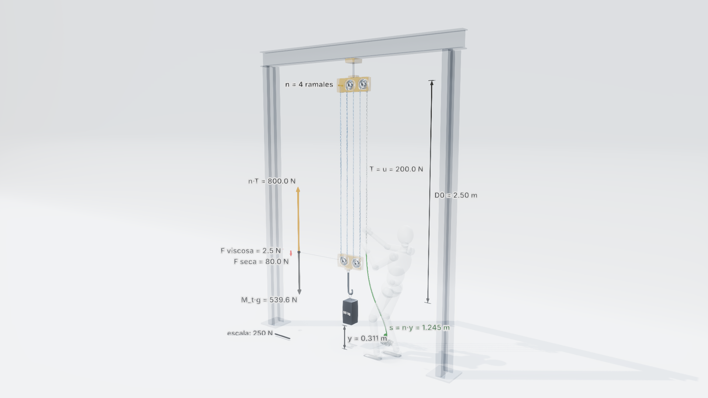
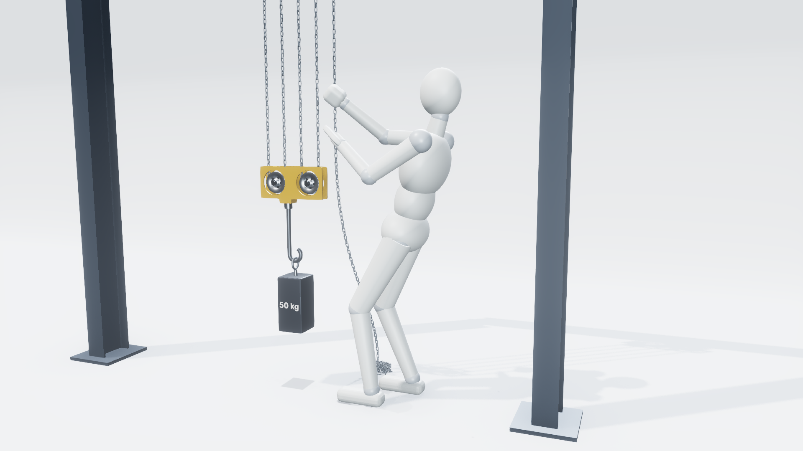
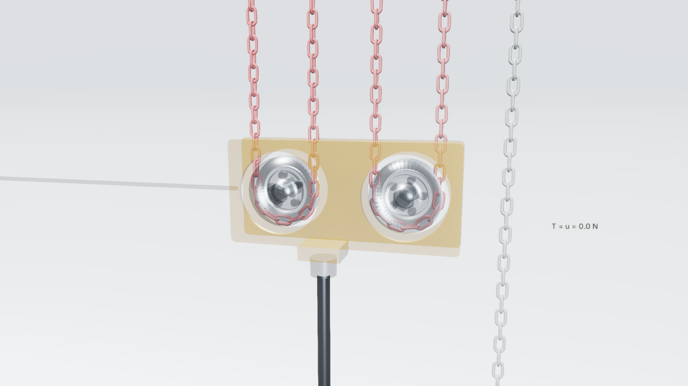

# Gemelo digital de un polipasto manual de cadena

Gemelo digital 3D, interactivo y sincronizado, de un polipasto manual de cadena rígida con número de ramales variable (2 a 6). La animación, las gráficas y los valores en vivo leen una sola simulación del modelo dinámico, validado contra MATLAB/Simulink.

Proyecto de la asignatura **Modelado y Simulación** · Universidad Popular del Cesar · Docente: Andrés Perpiñán Reyes.

**Autoras:** Sharif Alejandra García Toledo y Melany Fabiana Alzate Rojas.



| Estudio | Análisis |
|---|---|
|  |  |
|  |  |

Las capturas de la escena se generaron con el botón **Capturar escena** (PNG de 1920 × 1080).

## Qué incluye

- **Escena 3D** en escala real: pórtico de perfil I, bloque fijo con ⌈n/2⌉ poleas, bloque móvil con ⌊n/2⌋ poleas, cadena de eslabones (InstancedMesh), gancho, carga y un maniquí que jala mano sobre mano.
- **Modo estudio** (iluminación de estudio, sombras suaves, materiales metálicos) y **modo análisis**: diagrama de fuerzas con escala común, ramales coloreados por tensión, cotas de y, s y D0, y la ecuación de movimiento evaluada en cada instante.
- **Gráficas** de y, ẏ, ÿ, u y T, s y N con cursor sincronizado, zoom y marcas de eventos.
- **Parámetros** con slider y campo numérico; la simulación se recalcula al instante sin reiniciar.
- **Validación con Simulink**: carga de `datos_mecanismo.csv`, curvas superpuestas, métricas de error y tabla de eventos.
- **Exportación** del CSV del gemelo con el formato de Simulink y captura PNG de la escena.
- **Modo presentación** (tecla P) y **ayuda** (tecla H) con todos los atajos.

## Modelo físico

Un grado de libertad: `y` es la posición de la carga, positiva hacia arriba desde el piso.

```
M_eq·ÿ = n·u − μ·n·u·sgn(ẏ) − M_t·g − b·ẏ + N

M_t     = M + m_b
m_p_eq  = (J_polea / r_polea²) · Σ k²            (k = 1..n)
λ       = m_r / (n·D0 + L1)
c_j     = 2·⌊j/2⌋        si n es par   (amarre en el bloque fijo)
        = 2·⌈j/2⌉ − 1    si n es impar (amarre en el bloque móvil)
m_r_eff = λ · (D0 · Σ c_j² + L1 · n²)
M_eq    = M_t + m_p_eq + m_r_eff
```

- Entrada: `u(t) = F0` si `t_on ≤ t < t_off`, y 0 en otro caso; `T = F = u`. El signo se suaviza con `sgn(ẏ) ≈ tanh(ẏ / v_s)`, `v_s = 0.01 m/s`.
- Piso: si `y ≤ 0`, `ẏ ≤ 0` y la fuerza neta no es positiva, `ÿ = 0` y la reacción `N` equilibra las fuerzas (choque sin rebote).
- Cinemática: `s = n·y`; la polea k gira con `ω_k = k·ẏ / r_polea`; el ramal j avanza con `c_j·ẏ`.
- Tensión por ramal: `T_j = u − (J_polea / r_polea²)·ÿ·Σ_{k=j..n} k − λ·L1·n·ÿ`.
- Integración: RK4 de paso fijo, Δt = 1 ms, 6 s (6001 muestras).

Parámetros por defecto: M = 50 kg, m_b = 5 kg, n = 4, g = 9.81 m/s², b = 2 N·s/m, μ = 0.1, J_polea = 0.0005 kg·m², r_polea = 0.05 m, m_r = 1.5 kg, D0 = 2.5 m, L1 = 2.0 m, F0 = 200 N, t_on = 0.5 s, t_off = 1.5 s.

## Requisitos de la guía y cómo se cumplen

| Requisito | Cómo se cumple |
|---|---|
| Animación 3D sincronizada con la simulación | La escena lee `y`, `ẏ` y `s` de la muestra actual en cada cuadro: el bloque móvil y la carga suben con `y`, cada polea gira con `ω_k`, cada eslabón se ubica por su coordenada material (los ramales avanzan con `c_j·ẏ`) y el operario jala al ritmo de `ṡ`. |
| Gráfica con cursor temporal | Cursor vertical y punto sobre cada curva en el t actual; arrastrar sobre la gráfica mueve la reproducción. |
| Valores numéricos instantáneos | Panel «Valores en vivo» (t, y, ẏ, ÿ, u, T, s, ṡ, N y derivados) y tarjeta del modo presentación. |
| Controles que modifican parámetros sin reiniciar | Sliders y campos numéricos sincronizados con rangos validados; la simulación se recalcula en unos 10 ms y el mecanismo y las curvas se actualizan de inmediato. |
| Coherencia con MATLAB/Simulink y `datos_mecanismo.csv` | Pruebas automáticas con los valores de MATLAB y comparación con el CSV real de Simulink (sección siguiente). |

## Validación con Simulink

Comparación del gemelo con `public/datos/datos_mecanismo.csv` (exportado del Scope de Simulink, parámetros por defecto, misma malla de 1 ms). El error máximo excluye ±5 ms alrededor de cada discontinuidad del modelo (t_on, t_off, despegue y aterrizaje), donde un desfase de un paso no es un error del modelo; el máximo total se informa aparte.

| Error | RMS | Máx. fuera de saltos | Máx. total |
|---|---|---|---|
| y | 0.272 mm | **0.811 mm** | 0.813 mm |
| ẏ | 0.235 mm/s | 0.425 mm/s | 0.599 mm/s |
| ÿ | 1.239 mm/s² | 3.301 mm/s² | 66.005 mm/s² |

| Evento | Gemelo | Simulink | Diferencia |
|---|---|---|---|
| Despegue | 0.501 s | 0.501 s | 0.0 ms |
| y máxima | 1.63884 m | 1.63829 m | 0.547 mm |
| t de y máxima | 1.829 s | 1.828 s | 1.0 ms |
| Aterrizaje | 2.495 s | 2.495 s | 0.0 ms |

Criterio de validación: error máximo de y menor a 1 mm y eventos a menos de 2 ms → **Validado**.

Valores de referencia de MATLAB que verifican las pruebas: M_eq = 72.50 kg, F_min = 149.88 N, a0 = 2.4890 m/s², despegue 0.501 s, y máx. 1.6388 m en 1.829 s, v máx. 2.4561 m/s en 1.500 s, v mín. −4.9072 m/s en 2.494 s, aterrizaje 2.495 s.

## Cómo ejecutar

Requisitos: Node.js 20.19 o superior (o 22.12+).

```bash
npm install
npm run dev        # servidor de desarrollo en http://localhost:5173
npm test           # pruebas (vitest)
npm run build      # build de producción en dist/
npm run preview    # sirve el build de producción
npm run lint       # oxlint
```

La aplicación funciona sin conexión: el HDR de iluminación y las fuentes están incluidos en el proyecto.

### Atajos de teclado

| Tecla | Acción |
|---|---|
| Espacio | Reproducir / pausar |
| R | Reiniciar |
| ← → | Retroceder / avanzar 0.01 s (en pausa) |
| 1 a 6 | Vistas de cámara |
| A | Estudio / Análisis |
| P | Modo presentación |
| H o ? | Ayuda |
| Esc | Cerrar la ayuda o salir de la presentación |
| F | Medidor de cuadros por segundo |

## Pruebas

`npm test` ejecuta más de 220 pruebas, entre ellas:

- Motor físico contra los valores de validación de MATLAB.
- Geometría: poleas fijas y móviles para n = 2..6, amarre según la paridad, conservación de la longitud de la cadena y velocidad `c_j·ẏ` de cada ramal.
- Operario: la mano que agarra baja con la cadena sin patinar y alcanza la cadena en toda la carrera.
- Lectura del CSV real de Simulink, métricas de validación y formato del CSV exportado (idéntico al de MATLAB, `%.15g`).
- Modo análisis: la ecuación de movimiento cuadra en todo instante para todos los escenarios, escala de las flechas y tensiones T_j.
- Interfaz: rangos de parámetros, sincronización slider–campo, atajos y encuadre de cámara.

## Estructura

```
src/
  fisica/           motor físico (RK4) validado contra MATLAB — única fuente de verdad
  estado/           estado global (zustand), parámetros y escenarios
  geometria/        disposición del polipasto, cadena y postura del operario (funciones puras)
  analisis/         ecuación evaluada, fuerzas, tensiones y acomodo de etiquetas
  graficas/         series, colores y zoom de las gráficas
  utilidades/       CSV de Simulink, validación y descargas
  hooks/            reloj de reproducción y atajos de teclado
  componentes/
    escena/         componentes 3D (React Three Fiber)
    ui/             paneles, gráficas (uPlot) y controles
public/
  datos/            datos_mecanismo.csv exportado de Simulink
  hdri/             HDR de estudio
docs/capturas/      capturas del README
```

## Limitaciones

- **Fuerza ideal del operario:** `u = F0` constante entre t_on y t_off, sin depender de la velocidad. Con los valores por defecto la cadena llega a `ṡ ≈ 9.8 m/s` y el operario desarrollaría `P = u·ṡ ≈ 1965 W`; una persona jala a unos 1–1.5 m/s y sostiene unos 200–300 W. Se mantiene así por coherencia con el modelo de MATLAB/Simulink.
- **Fricción seca suavizada:** con `tanh(ẏ/v_s)` la fricción es nula en reposo, por lo que con F0 apenas menor que F_min la carga puede despegar unos milímetros.
- **Tope superior:** si la carga llega a `y = D0 − 0.4 m`, el modelo la detiene; en el modo análisis esa restricción se muestra como `R_tope`.
- **Representación del tramo libre:** la mano del operario queda a la altura `H_fijo − L1` y la cadena recogida (`s = n·y`) se acumula en un montón en el piso; la longitud total de la cadena se conserva exactamente.
- **Rango de L1:** se limita para que la mano quede al alcance del maniquí.

## Tecnologías y créditos

Vite, React, three.js, React Three Fiber, drei, postprocessing, zustand, uPlot, Tailwind CSS y vitest.

- Iluminación: HDR `studio_small_03` de [Poly Haven](https://polyhaven.com/a/studio_small_03) (CC0).
- Tipografía: Inter, vía `@fontsource/inter` (SIL Open Font License).
- Paleta de las gráficas validada para daltonismo.
